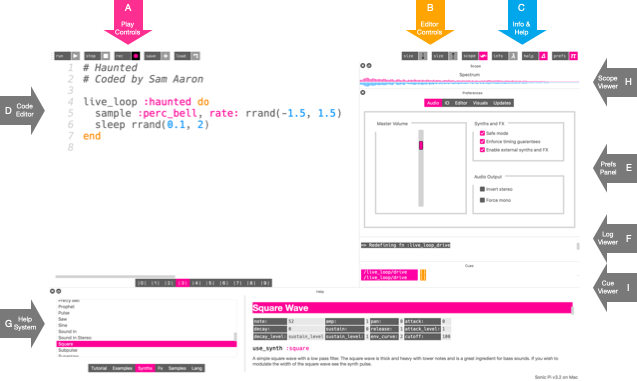

1.2 Exploring the Interface

# The Sonic Pi Interface

Sonic Pi has a very simple interface for coding music. Let's spend a
little time exploring it.

* *A* - Play Controls
* *B* - Editor Controls
* *C* - Info and Help
* *D* - Code Editor
* *E* - Prefs Panel
* *F* - Log Viewer
* *G* - Help System
* *H* - Scope Viewer

## A. Play Controls

These pink buttons are the main controls for starting and stopping
sounds. There's the *Run* button for running the code in the editor,
*Stop* for stopping all running code, *Save* for saving the code to an
external file and *Record* to create a recording (a WAV file) of the
sound playing.

## B. Editor Controls

These orange buttons allow you to manipulate the code editor. The *Size
+* and *Size -* buttons allow you to make the text bigger and
smaller.

## C. Info and Help

These blue buttons give you access to information, help and
preferences. The *Info* button will open up the information window which
contains information about Sonic Pi itself - the core team, history,
contributors and community. The *Help* button toggles the help system
(*G*) and the *Prefs* button toggles the preferences window which allows
you to control some basic system parameters.

## D. Code Editor

This is the area where you'll write your code and compose/perform
music. It's a simple text editor where you can write code, delete it,
cut and paste, etc. Think of it like a very basic version of Word or
Google Docs. The editor will automatically colour words based on their
meaning in the code. This may seem strange at first, but you'll soon
find it very useful. For example, you'll know something is a number
because it is blue.

## E. Prefs Panel

Sonic Pi supports a number of tweakable preferences which can be
accessed by toggling the *prefs* button in the Info and Help button
set. This will toggle the visibility of the Prefs Panel which includes a
number of options to be changed. Examples are forcing mono mode,
inverting stereo, toggling log output verbosity and also a volume slider
and audio selector on the Raspberry Pi.

## F. Log Viewer

When you run your code, information about what the program is doing will
be displayed in the log viewer. By default, you'll see a message for
every sound you create with the exact time the sound was triggered. This
is very useful for debugging your code and understanding what your code
is doing.

## G. Help System

One of the most important parts of the Sonic Pi interface is
the help system which appears at the bottom of the window. This can be
toggled on and off by clicking on the blue *Help* button. The help
system contains help and information about all aspects of Sonic Pi
including this tutorial, a list of available synths, samples, examples,
FX and a full list of all the functions Sonic Pi provides for coding
music.

## H. Scope Viewer

The scope viewer allows you to see the sound you're hearing. You can
easily see that the saw wave looks like a saw and that the basic beep is
a curvey sine wave. You can also see the difference between loud and
quiet sounds by the size of the lines. There are 3 scopes to play with -
the default is a combined scope for the left and right channels, there
is a stereo scope which draws a separate scope for each channel. Finally
there is a Lissajous curve scope which will show the phase relationship
between the left and right channels and allows you to draw pretty
pictures with sound (https://en.wikipedia.org/wiki/Lissajous_curve).
