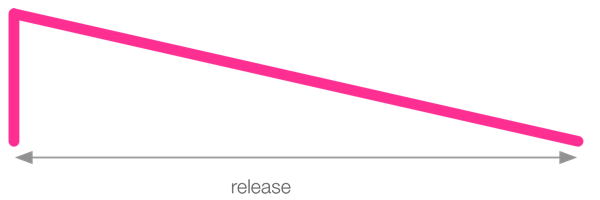
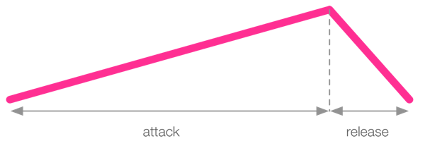
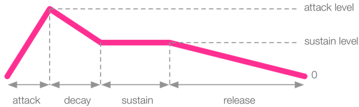

2.4 Duration with Envelopes

# Duration with Envelopes

In an earlier section, we looked at how we can use the `sleep` command
to control when to trigger our sounds. However, we haven't yet been able
to control the duration of our sounds.

In order to give us a simple, yet powerful means of *controlling the
duration* of our sounds, Sonic Pi provides the notion of an *ADSR
amplitude envelope* (we'll cover what ADSR means later in this
section). An amplitude envelope offers two useful aspects of control:

* control over the duration of a sound
* control over the amplitude of a sound

## Duration

The duration is the length the sound lasts for. A longer duration means
that you hear the sound for longer. Sonic Pi's sounds all have a
controllable amplitude envelope, and the total duration of that envelope
is the duration of the sound. Therefore, by controlling the envelope you
control the duration.

## Amplitude

The ADSR envelope not only controls duration, it also gives you *fine
control over the amplitude of the sound*. All audible sounds start and
end silent and contain some non-silent part in-between. Envelopes allow
you to slide and hold the amplitude of non-silent parts of the
sound. It's like giving someone instructions on how to turn up and down
the volume of a guitar amplifier. For example you might ask someone to
"start at silence, slowly move up to full volume, hold it for a bit,
then quickly fall back to silence." Sonic Pi allows you to program
exactly this behaviour with envelopes.

Just to recap, as we have seen before, an amplitude of 0 is silence and
an amplitude of 1 is normal volume.

Now, let us look at each of the parts of the envelopes in turn.

## Release Phase

The only part of the envelope that's used by default is the release
time. This is the time it takes for the synth's sound to fade out. All
synths have a release time of 1 which means that by default they have a
duration of 1 beat (which at the default BPM of 60 is 1 second):

```
play 70
```

The note will be audible for 1 second.  Go ahead and time it :-) This is
short hand for the longer more explicit version:

```
play 70, release: 1
```

Notice how this sounds exactly the same (the sound lasts for one
second). However, it's now very easy to change the duration by modifying
the value of the `release:` opt:

```
play 60, release: 2
```

We can make the synth sound for a very short amount of time by using a
very small release time:

```
play 60, release: 0.2
```

The duration of the release of the sound is called the *release phase*
and by default is a linear transition (i.e. a straight line). The
following diagram illustrates this transition:



The vertical line at the far left of the diagram shows that the sound
starts at 0 amplitude, but goes up to full amplitude immediately (this
is the attack phase which we'll cover next). Once at full amplitude it
then moves in a straight line down to zero taking the amount of time
specified by `release:`. *Longer release times produce longer synth
fade outs.*

You can therefore change the duration of your sound by changing the
release time. Have a play adding release times to your music.

## Attack Phase

By default, the *attack phase* is 0 for all synths which means they move
from 0 amplitude to 1 immediately. This gives the synth an initial
percussive sound. However, you may wish to fade your sound in. This can
be achieved with the `attack:` opt. Try fading in some sounds:

```
play 60, attack: 2
sleep 3
play 65, attack: 0.5
```

You may use multiple opts at the same time. For example for a short
attack and a long release try:

```
play 60, attack: 0.7, release: 4
```

This short attack and long release envelope is illustrated in the
following diagram:


Of course, you may switch things around. Try a long attack and a short
release:

```
play 60, attack: 4, release: 0.7
```



Finally, you can also have both short attack and release times for
shorter sounds.

```
play 60, attack: 0.5, release: 0.5
```


## Sustain Phase

In addition to specifying attack and release times, you may also specify
a sustain time to control the *sustain phase*. This is the time for
which the sound is maintained at full amplitude between the attack and
release phases.

```
play 60, attack: 0.3, sustain: 1, release: 1
```


The sustain time is useful for important sounds you wish to give full
presence in the mix before entering an optional release phase. Of
course, it's totally valid to set both the `attack:` and `release:` opts
to 0 and just use the sustain to have absolutely no fade in or fade out
to the sound. However, be warned, a release of 0 can produce clicks in
the audio and it's often better to use a very small value such as 0.2.

## Decay Phase

For an extra level of control, you can also specify a decay time. This
is a phase of the envelope that fits between the attack and sustain
phases and specifies a time where the amplitude will drop from the
`attack_level:` to the `decay_level:` (which unless you explicitly set
it will be set to the `sustain_level:`). By default, the `decay:` opt is
0 and both the attack and sustain levels are 1 so you'll need to specify
them for the decay time to have any effect:

```
play 60, attack: 0.1, attack_level: 1, decay: 0.2, sustain_level: 0.4, sustain: 1, release: 0.5
```



## Decay Level

One last trick is that although the `decay_level:` opt defaults to be
the same value as `sustain_level:` you can explicitly set them to
different values for full control over the envelope. This allows you to
to create envelopes such as the following:

```
play 60, attack: 0.1, attack_level: 1, decay: 0.2, decay_level: 0.3, sustain: 1, sustain_level: 0.4, release: 0.5
```


It's also possible to set the `decay_level:` to be higher than `sustain_level:`:

```
play 60, attack: 0.1, attack_level: 0.1, decay: 0.2, decay_level: 1, sustain: 0.5, sustain_level: 0.8, release: 1.5
```


## ADSR Envelopes

So to summarise, Sonic Pi's ADSR envelopes have the following phases:

1. *attack* - time from 0 amplitude to the `attack_level`,
2. *decay* - time to move amplitude from `attack_level` to `decay_level`,
3. *sustain* - time to move the amplitude from `decay_level` to `sustain_level`,
4. *release* - time to move amplitude from `sustain_level` to 0

It's important to note that the duration of a sound is the summation of
the times of each of these phases. Therefore the following sound will
have a duration of 0.5 + 1 + 2 + 0.5 = 4 beats:

```
play 60, attack: 0.5, attack_level: 1, decay: 1, sustain_level: 0.4, sustain: 2, release: 0.5
```

Now go and have a play adding envelopes to your sounds...
