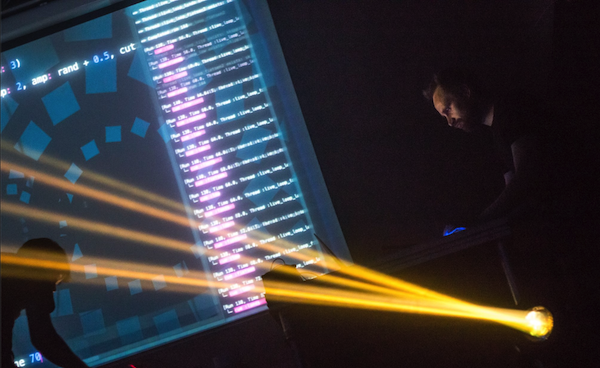

A.2 Live Coding

# Live Coding

The laser beams sliced through the wafts of smoke as the subwoofer
pumped bass deep into the bodies of the crowd. The atmosphere was ripe
with a heady mix of synths and dancing. However something wasn't quite
right in this nightclub. Projected in bright colours above the DJ booth
was futuristic text, moving, dancing, flashing. This wasn't fancy
visuals, it was merely a projection of Sonic Pi running on a Raspberry
Pi. The occupant of the DJ booth wasn't spinning disks, he was writing,
editing and evaluating code. Live. This is Live Coding.



This may sound like a far fetched story from a futuristic night club but
coding music like this is a growing trend and is often described as Live
Coding (http://toplap.org). One of the recent directions this approach
to music making has taken is the Algorave (http://algorave.com) - events
where artists like myself code music for people to dance to. However,
you don't need to be in a nightclub to Live Code - with Sonic Pi v2.6+
you can do it anywhere you can take your Raspberry Pi and a pair of
headphones or some speakers.  Once you reach the end of this article,
you'll be programming your own beats and modifying them live. Where you
go afterwards will only be constrained by your imagination.

## Live Loop

The key to live coding with Sonic Pi is mastering the `live_loop`. Let's
look at one:

```
live_loop :beats do
  sample :bd_haus
  sleep 0.5
end
```

There are 4 core ingredients to a `live_loop`. The first is its
name. Our `live_loop` above is called `:beats`. You're free to call your
`live_loop` anything you want. Go crazy. Be creative. I often use names
that communicate something about the music they're making to the
audience. The second ingredient is the `do` word which marks where the
`live_loop` starts. The third is the `end` word which marks where the
`live_loop` finishes, and finally there is the body of the `live_loop`
which describes what the loop is going to repeat - that's the bit
between the `do` and `end`. In this case we're repeatedly playing a bass
drum sample and waiting for half a beat. This produces a nice regular
bass beat. Go ahead, copy it into an empty Sonic Pi buffer and hit
run. Boom, Boom, Boom!.

## Redefining On-the-fly

Ok, so what's so special about the `live_loop`? So far it just seems
like a glorified `loop`! Well, the beauty of `live_loop`s is that you
can redefine them on-the-fly. This means that whilst they're still
running, you can change what they do. This is the secret to live coding
with Sonic Pi. Let's have a play:

```
live_loop :choral_drone do
  sample :ambi_choir, rate: 0.4
  sleep 1
end
```

Now press the Run button or hit `Meta-r`. You're now listening to
some gorgeous choir sounds. Now, whilst it's still playing, change the
rate from `0.4` to `0.38`. Hit run again. Woah! Did you hear the choir
change note? Change it back up to `0.4` to return back to how it
was. Now, drop it to `0.2`, down to `0.19` and then back up to
`0.4`. See how changing just one parameter on the fly can give you real
control of the music? Now play around with the rate yourself - choose
your own values. Try negative numbers, really small numbers and large
numbers. Have fun!

## Sleeping is important

One of the most important lessons about `live_loop`s is that they need
rest. Consider the following `live_loop`:

```
live_loop :infinite_impossibilities do
  sample :ambi_choir
end
```

If you try running this code, you'll immediately see Sonic Pi
complaining that the `live_loop` did not sleep. This is a safety system
kicking in! Take a moment to think about what this code is asking the
computer to do. That's right, it's asking the computer to play an
infinite amount of choir samples in zero time. Without the safety system
the poor computer will try and do this and crash and burn in the
process. So remember, your `live_loop`s must contain a `sleep`.


## Combining Sounds

Music is full of things happening at the same time. Drums at the same
time as bass at the same time as vocals at the same time as
guitars... In computing we call this concurrency and Sonic Pi provides
us with an amazingly simple way of playing things at the same
time. Simply use more than one `live_loop`!

```
live_loop :beats do
  sample :bd_tek
  with_fx :echo, phase: 0.125, mix: 0.4 do
    sample  :drum_cymbal_soft, sustain: 0, release: 0.1
    sleep 0.5
  end
end

live_loop :bass do
  use_synth :tb303
  synth :tb303, note: :e1, release: 4, cutoff: 120, cutoff_attack: 1
  sleep 4
end
```

Here, we have two `live_loop`s, one looping quickly making beats and
another looping slowly making a crazy bass sound.

One of the interesting things about using multiple `live_loop`s is that
they each manage their own time. This means it's really easy to create
interesting polyrhythmical structures and even play with phasing Steve
Reich style. Check this out:

```
# Steve Reich's Piano Phase

notes = (ring :E4, :Fs4, :B4, :Cs5, :D5, :Fs4, :E4, :Cs5, :B4, :Fs4, :D5, :Cs5)

live_loop :slow do
  play notes.tick, release: 0.1
  sleep 0.3
end

live_loop :faster do
  play notes.tick, release: 0.1
  sleep 0.295
end
```

## Bringing it all together

In each of these tutorials, we'll end with a final example in the form
of a new piece of music which draws from all of the ideas
introduced. Read this code and see if you can imagine what it's
doing. Then, copy it into a fresh Sonic Pi buffer and hit Run and
actually hear what it sounds like. Finally, change one of the numbers or
comment and uncomment things out. See if you can use this as a starting
point for a new performance, and most of all have fun! See you next
time...

```
with_fx :reverb, room: 1 do
  live_loop :time do
    synth :prophet, release: 8, note: :e1, cutoff: 90, amp: 3
    sleep 8
  end
end

live_loop :machine do
  sample :loop_garzul, rate: 0.5, finish: 0.25
  sample :loop_industrial, beat_stretch: 4, amp: 1
  sleep 4
end

live_loop :kik do
  sample :bd_haus, amp: 2
  sleep 0.5
end

with_fx :echo do
  live_loop :vortex do
    # use_random_seed 800
    notes = (scale :e3, :minor_pentatonic, num_octaves: 3)
    16.times do
      play notes.choose, release: 0.1, amp: 1.5
      sleep 0.125
    end
  end
end
```
