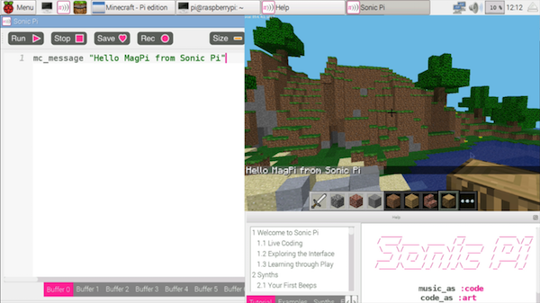

A.6 Musical Minecraft 

# Musical Minecraft


Hello and welcome back! In the previous tutorials we've focussed purely
on the music possibilities of Sonic Pi - (turning your Raspberry Pi into
a performance ready musical instrument). So far we've learned how to:

* Live Code - changing the sounds on-the-fly,
* Code some huge beats,
* Generate powerful synth leads,
* Re-create the famous TB-303 acid-bass sound.

There's so much more to show you (which we will explore in future
editions). However, this month, let's look at something Sonic Pi can do
that you probably didn't realise: control Minecraft.

## Hello Minecraft World

OK, let's get started. Boot up your Raspberry Pi, fire up Minecraft Pi
and create a new world. Now start up Sonic Pi and re-size and move your
windows so you can see both Sonic Pi and Minecraft Pi at the same time.

In a fresh buffer type the following:

```
mc_message "Hello Minecraft from Sonic Pi!"
```
    
Now, hit Run. Boom! Your message appeared in Minecraft! How easy was
that? Now, stop reading this for a moment and play about with your own
messages. Have fun!



## Sonic Teleporter

Now let's do some exploring. The standard option is to reach for the
mouse and keyboard and start walking around. That works, but it's pretty
slow and boring. It would be far better if we had some sort of teleport
machine. Well, thanks to Sonic Pi, we have one. Try this:

```
mc_teleport 80, 40, 100
```
    
Crikey! That was a long way up. If you weren't in flying-mode then you
would have fallen back down all the way to the ground. If you double-tap
space to enter flying-mode and teleport again, you'll stay hovering at
the location you zap to.

Now, what do those numbers mean? We have three numbers which describe
the coordinates of where in the world we want to go. We give each number
a name - x, y and z:

* x - how far left and right (80 in our example)
* y - how high we want to be (40 in our example)
* z - how far forward and back (100 in our example)

By choosing different values for x, y and z we can teleport *anywhere*
in our world. Try it! Choose different numbers and see where you can end
up. If the screen goes black it's because you've teleported yourself
under the ground or into a mountain. Just choose a higher y value to get
back out above land. Keep on exploring until you find somewhere you
like...

Using the ideas so far, let's build a Sonic Teleporter which makes a fun
teleport sound whilst it whizzes us across the Minecraft world:

```
mc_message "Preparing to teleport...."
sample :ambi_lunar_land, rate: -1
sleep 1
mc_message "3"
sleep 1
mc_message "2"
sleep 1
mc_message "1"
sleep 1
mc_teleport 90, 20, 10
mc_message "Whoooosh!"
```
    


## Magic Blocks

Now you've found a nice spot, let's start building. You could do what
you're used to and start clicking the mouse furiously to place blocks
under the cursor. Or you could use the magic of Sonic Pi. Try this:

```
x, y, z = mc_location
mc_set_block :melon, x, y + 5, z
```

Now look up! There's a melon in the sky! Take a moment to look at the
code. What did we do? On line one we grabbed the current location of
Steve as the variables x, y and z. These correspond to our coordinates
described above. We use these coordinates in the fn `mc_set_block` which
will place the block of your choosing at the specified coordinates. In
order to make something higher up in the sky we just need to increase
the y value which is why we add 5 to it. Let's make a long trail of them:

```
live_loop :melon_trail do
  x, y, z = mc_location
  mc_set_block :melon, x, y-1, z
  sleep 0.125
end
```

Now, jump over to Minecraft, make sure you're in flying-mode (double tap
space if not) and fly all around the world. Look behind you to see a
pretty trail of melon blocks! See what kind of twisty patterns you can
make in the sky.

## Live Coding Minecraft

Those of you that have been following this tutorial over the last few
months will probably have your minds blown at this point. The trail of
melons is pretty cool, but the most exciting part of the previous
example is that you can use `live_loop` with Minecraft! For those that
don't know, `live_loop` is Sonic Pi's special magic ability that no
other programming language has. It lets you run multiple loops at the
same time and allows you to change them whilst they run. They are
incredibly powerful and amazing fun. I use `live_loop`s to perform music
in nightclubs with Sonic Pi - DJs use discs and I use `live_loop`s :-)
However, today we're going to live code both music and Minecraft.

Let's get started. Run the code above and start making your melon
trail again. Now, without stopping the code, just simply change `:melon` to
`:brick` and hit run. Hey presto, you're now making a brick trail. How
simple was that! Fancy some music to go with it? Easy. Try this:

```
live_loop :bass_trail do
  tick
  x, y, z = mc_location
  b = (ring :melon, :brick, :glass).look
  mc_set_block b, x, y -1, z
  note = (ring :e1, :e2, :e3).look
  use_synth :tb303
  play note, release: 0.1, cutoff: 70
  sleep 0.125
end
```
    
Now, whilst that's playing start changing the code. Change the block
types - try `:water`, `:grass` or your favourite block type. Also, try
changing the cutoff value from `70` to `80` and then up to `100`. Isn't
this fun?

## Bringing it all together


Let's combine everything we've seen so far with a little extra
magic. Let's combine our teleportation ability with block placing and
music to make a Minecraft Music Video. Don't worry if you don't
understand it all, just type it in and have a play by changing some of
the values whilst it's running live. Have fun and see you next time...
    
```
live_loop :note_blocks do
  mc_message "This is Sonic Minecraft"
  with_fx :reverb do
    with_fx :echo, phase: 0.125, reps: 32 do
      tick
      x = (range 30, 90, step: 0.1).look
      y = 20
      z = -10
      mc_teleport x, y, z
      ns = (scale :e3, :minor_pentatonic)
      n = ns.shuffle.choose
      bs = (knit :glass, 3, :sand, 1)
      b = bs.look
      synth :beep, note: n, release: 0.1
      mc_set_block b, x+20, n-60+y, z+10
      mc_set_block b, x+20, n-60+y, z-10
      sleep 0.25
    end
  end
end

live_loop :beats do
  sample :bd_haus, cutoff: 100
  sleep 0.5
end
```
