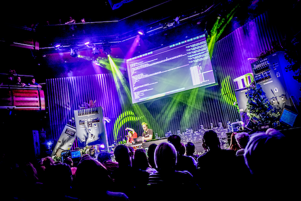
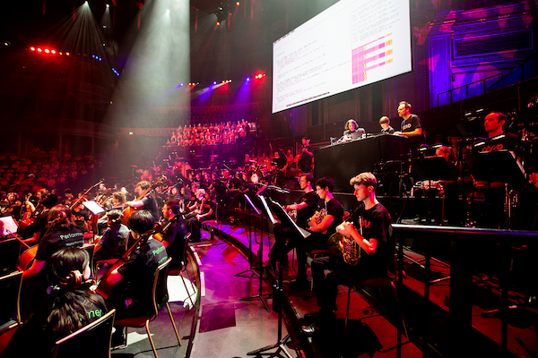

A.20 Creative coding in the classroom with Sonic Pi

# Creative coding in the classroom with Sonic Pi

(This article was published in [issue 9 of the Hello World Magazine](https://helloworld.raspberrypi.org/issues/9))

Code is one of the most creative media that humans have created. The
initially obscure symbols of parentheses and lambdas are not just deeply
rooted in science and mathematics, they are the closest we have managed
to get to casting the same kind of magical spells as Gandalf and Harry
Potter. I believe that this provides a powerful means of engagement in
our learning spaces. Through the magic of code we are able to conjure up
individually meaningful stories and learning experiences.

We are surrounded by magical experiences. From the sleight of hand of a
stage magician making the ball disappear into thin air, to the wonder of
seeing your favourite band perform on a big stage. It is these "wow"
moments that inspire us to pick up a magic book and learn the French
Drop or to start jamming power chords on an old guitar. How might we
create similarly deep and lasting senses of wonder that will motivate
people to practice and learn the fundamentals of programming?

## Musical Engines and Notation

The histories of music and computers have been intricately woven together
since the inception of computing machines, or "engines" as Charles
Babbage's powerful analytical engine was called. Back in 1842 the
Mathematician Ada Lovelace, who worked very closely with Babbage, saw
the creative potential of these engines. Whilst these first engines had
originally been designed to accurately solve hard maths problems, Ada
dreamt about making music with them:

"..the engine might compose elaborate and scientific pieces of music of
any degree of complexity or extent." Ada Lovelace, 1842.

Of course, today in 2019 much of our music, regardless of genre, has
either been composed, produced or mastered with a digital
computer. Ada's dream came true.  It is even possible to trace the
history back even further. If you see coding as the art of writing
sequences of special symbols that instruct a computer to do specific
things, then musical composition is a very similar practice. In Western
music, the symbols are black dots positioned on a stave of lines that
tell the musician which notes to play and when. Intriguingly, if we
trace the roots of Western music notation back to the Italian
Benedictine monk, Guido d'Arezzo, we find that the dots and lines system
that modern orchestras use is just one of a number of notation systems
he worked on. Some of the others were much closer to what we might now
see as code.

In education, magical meaningful experiences with computers and
programming languages have been explored since the late '60s. Computer
education pioneers Seymour Papert, Marvin Minsky and Cynthia Solomon
explored simple Lisp-based languages that moved pens over large pieces
of paper. With just a few simple commands it was possible to program the
computer to draw any picture. They even experimented by extending their
Logo language from drawing to music. Papert wrote about learning through
experiencing the reconstruction of knowledge rather than its
transmission. Getting people to play with things directly was an
important part of his group's work.


## Sonic Pi Performances


Jylda and Sam Aaron perform at the Thinking Digital Conference in the
Sage Gateshead. Photo credit: TyneSight Photos.

Sonic Pi has been used to perform in a wide range of venues such as
school halls, nightclubs, outdoor stages at musical festivals, college
chapels and prestigious music venues. For example the amazing Convo
project which brought 1000 children together in the Royal Albert Hall to
perform an ambitious new composition by composer Charlotte Harding. The
piece was written for traditional instruments, choirs, percussion and
Sonic Pi code. The pop-artist Jylda also performed with Sonic Pi in the
Sage Gateshead for the Thinking Digital Conference, where she created a
unique live-coded improvised remix of her song Reeled.


Sonic Pi used as one of the instruments as part of Convo at the Royal
Albert Hall. Photo credit: Pete Jones.


## Live coding in the classroom

Sonic Pi is a code-based music creation and performance tool that builds
on all of these ideas. Unlike the majority of computing education
software, it is both simple enough to use for education and also
powerful enough for professionals. It has been used to perform in
international music festivals, used to compose in a range of styles from
classical, EDM and heavy metal, and was even reviewed in the Rolling
Stone magazine. It has a diverse community of over 1.5 million live
coders with a variety of backgrounds all learning and sharing their
ideas and thoughts through the medium of code. It is free to download
for Mac, PC and Raspberry Pi and includes a friendly tutorial that
assumes you know nothing about either code or music.

Sonic Pi was initially conceived as a response to the UK's newly
released Computing curriculum in 2014. The goal was to find a motivating
and fun way to teach the fundamentals of programming. It turns out that
there is a lot in common and it's huge fun to explain sequencing as
melody, iteration as rhythm, conditionals as musical variety. I
developed the initial designs and first iterations of the platform with
Carrie Anne Philbin, who brought a teacher’s perspective to the
project. Since then, Sonic Pi has undergone iterative improvements
thanks to the feedback gained from observing learners and collaborating
directly with educators in the classroom. A core design philosophy was
to never add a feature that couldn't be easily taught to a 10 year old
child. This meant that most ideas had to be heavily refined and reworked
until they were simple enough. Making things simple whilst keeping them
powerful continues to be the hardest part of the project.

In order to provide the magical motivation, Sonic Pi's design was never
limited to a pure focus on education. Ideally there would be famous
musicians and performers using Sonic Pi as a standard instrument
alongside guitars, drums, vocals, synths, violins, etc. These performers
would then act as motivational role models demonstrating the creative
potential of code. For this to be possible sufficient focus and effort
therefore had to be placed on making it a powerful instrument whilst
still keeping it simple enough for 10 year olds to pick up. In addition
to educators, I also worked directly with a variety of different artists
in classrooms, art galleries, studios and venues in the early stages of
Sonic Pi’s development. This provided essential feedback which enabled
Sonic Pi to grow and ultimately flourish as a tool for creative
expression.

There were a number of exciting and unexpected side effects of this dual
focus on education and professional musicians. Many of the features are
beneficial to both groups. For example, a lot of effort has been put
into making error messages more friendly and useful (rather than being a
huge complicated mess of jargon). This turns out to be very useful when
you write a bug while performing in front of thousands of
people. Additionally, functionality such as playing studio quality audio
samples, adding audio effects, providing access to live audio from the
microphone all turn out to make the learning experience more fun,
rewarding and ultimately meaningful.

The Sonic Pi community continues to grow and share amazing code
compositions, lesson plans, musical algorithms, and much more. Much of
this happens on our friendly forum in_thread (in-thread.sonic-pi.net)
which is home to a very diverse group of people that includes educators,
musicians, programmers, artists and makers. It is a real joy to see
people learn to use code to express themselves in new ways and for that
in turn to inspire others to do the same.

# Some fun capabilities

From a Computer Science perspective, Sonic Pi provides you with the
building blocks to teach you the basics as found in the UK's curriculum
such as sequencing, iteration, conditionals, functions, data structures,
algorithms, etc. However, it also builds on a number of important and
relevant concepts which have become adopted in mainstream industry such
as concurrency, events, pattern matching, distributed computing and
determinism - all whilst keeping things simple enough to explain to a 10
year old child.

Getting started is as simple as:

```
play 70
```

A melody can be constructed with one more command, sleep:

```
play 70
sleep 1
play 72
sleep 0.5
play 75
```

In this example, we play the note 70 (roughly the 70th note on a piano),
wait for 1 second, play note 72, wait for half a second and then play
note 75. What's interesting here is that with just two commands we have
access to pretty much all of Western notation (which notes to play and
when) and learners can code any melody they've ever heard. This leads to
huge variety in expressive outcomes whilst focussing on the same
computing concept: sequencing in this case.

Taking ideas from the professional music world, we can also play back
any recorded sound. Sonic Pi can play any audio file on your computer
but also has a number of sounds built-in to make things easy to get
started:

```
sample :loop_amen
```

This code will play back the drum break which was a pillarstone to early
hip-hop, Drum and Bass and Jungle. For example, a number of early
hip-hop artists played this drum break back at half speed to give it a
more laid-back feeling:

```
sample :loop_amen, rate: 0.5
```

In the 90s a number of music scenes burst out of new technology which
enabled artists to take drum breaks like this apart and reassemble in a
different order. For example:

```
live_loop :jungle do
 sample :loop_amen, onset: pick
 sleep 0.125
end
```

In this example we introduce a basic loop called :jungle which picks a
random drum hit from our audio sample, waits for an eighth of a second
and then picks another drum hit. This results in an endless stream of
random drum beats to dance to whilst you experience what a loop is.
